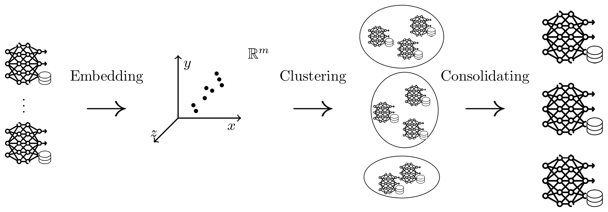

# ModelForge

<div align="center">



**Model Clustering and Consolidation System for Machine Learning Models**

[](https://www.python.org/downloads/release/python-311/)
[](https://python-poetry.org/)
[](https://opensource.org/licenses/MIT)

</div>

## 📋 Overview

ModelForge is an advanced system for clustering and consolidating machine learning models. It efficiently reduces a large collection of models into a smaller set of representative models while preserving performance characteristics.

## ✨ Key Features

- **Model Clustering** - Group similar models based on performance metrics and characteristics
- **Model Consolidation** - Generate a smaller, representative set of models from the original collection
- **Performance Evaluation** - Comprehensively evaluate consolidated models against the original set
- **Visualization Tools** - Analyze model similarities and differences through intuitive visualizations

## 🚀 Getting Started

### Prerequisites

- Python 3.11 or higher
- Poetry (dependency management)

### Installation

Clone the repository and install dependencies:

```bash
git clone https://github.com/yourusername/modelforge.git
cd modelforge
poetry install
```

### Quick Usage

See our [demo notebook](docs/demo.ipynb) for a minimal example of how to use ModelForge.

## 📚 Documentation

- [Using Your Own Datasets](docs/own_dataset.md) - Learn how to create and format your own datasets
- [Evaluation Datasets](docs/datasets.md) - Details on datasets used in ModelForge evaluation
- [Reproducibility](docs/reproducibility.md) - Instructions to reproduce our research results
- [Visualization & Plots](docs/plots.md) - Detailed explanation of visualization options and additional results

## 🔬 Research & Results

Our research demonstrates significant efficiency gains when using ModelForge for model consolidation while maintaining performance thresholds. See our [paper](link-to-paper) for complete details.

## 📝 Citation

If you use ModelForge in your research, please cite our paper:

```bibtex
TBD
```

## 🤝 Contributing

Contributions are welcome! Please feel free to submit a Pull Request.

## 📄 License

This project is licensed under the MIT License - see the [LICENSE](LICENSE) file for details.

