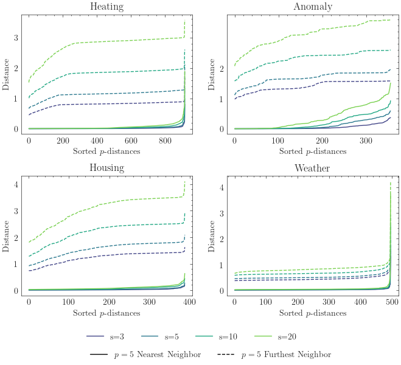

# 📈 Experimental Results

**Visualizations of ModelForge embedding and clustering performance**

See the paper for more details on the experiments and explanation. Further interpretation of the embedding space, which had to be obmitted in the paper due to space constraints, is provided [below](#inspection-of-embedding-space).

## 🎯 Effectiveness of embedding strategies

<em>Aggregated performance scores across different embedding strategies</em>

<em>Aggregated performance scores broken down by dataset</em>

<em>Performance scores as the number of clusters increases</em>

## 🧩 Influence of embedding size

<em>Effect of embedding dimensionality on performance</em>

<em>Normalized Mutual Information scores at different embedding dimensions</em>

<em>k-Nearest Neighbor distance analysis</em>

## 🔬 Inspection of embedding space

<em>2D UMAP projection of the model embedding space</em>

### Prediction error of models in the embedding space

To further understand the embedding space, we inspect the ends of the "U" shape by getting 5 models for each "end" of the U shape. We then plot the prediction error of these models against the training sets, which have been used for constructing the embedding space. The results indicate that there are two major behavioral paths: Some overestimate the prediction error, while others underestimate it.

#### Heating Dataset

<em>Prediction error analysis for models in the Heating dataset</em>

#### Weather Dataset

<em>Prediction error analysis for models in the Weather dataset</em>

#### Housing Dataset

<em>Prediction error analysis for models in the Housing dataset</em>

